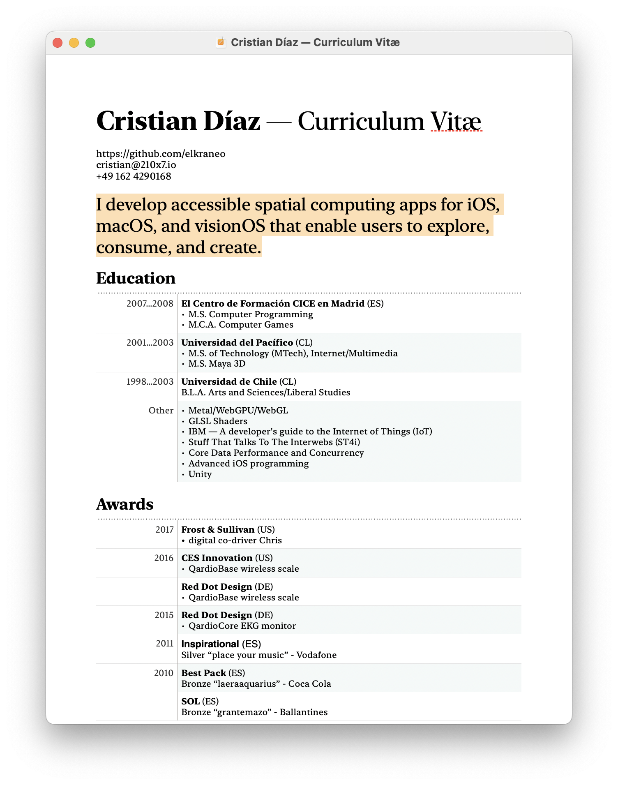

## I develop accessible spatial computing apps for iOS, macOS, and visionOS that enable users to explore, consume, and create.

[Cristian Díaz — Curriculum Vitæ](../assets/Cristian%20Díaz%20—%20Curriculum%20Vitæ.pdf)
